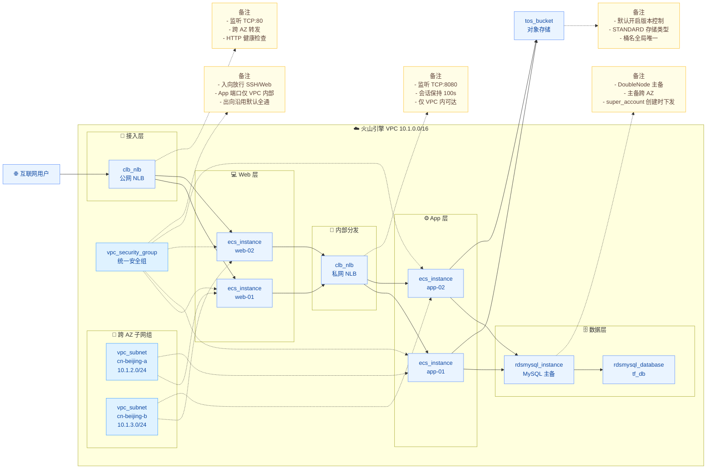

# 高可用、安全可扩展的 Web 应用部署 — Volcenginecc 重构版

## 1. 业务背景

在企业数字化转型浪潮中，Web 应用对基础设施有明确的核心诉求：

1. **业务高可用**：访问入口、应用计算与数据存储均需具备跨可用区容灾能力，避免单点故障导致服务中断。
2. **流量分发与隔离**：互联网流量需要统一接入与分发，前端 Web 与后端 App 之间需要内部分流，并对不同层级实施网络隔离与最小化访问控制。
3. **快速一键交付**：传统手工搭建涉及多控制台、多角色协同，部署一致性差、扩容周期长，难以满足敏捷上线需求。
4. **数据持久化与可演进**：业务数据需要主备容灾的关系型数据库，非结构化资产需要可弹性扩展的对象存储。

本项目基于参考工程 [`volcanoengine-landing-zone/example/classic-load-balance`](https://github.com/volcengine/volcanoengine-landing-zone/tree/master/example/classic-load-balance)，使用 **volcenginecc Provider** 重构同等架构，沉淀为模块化、可复用、已实测落地的 IaC 工程。

## 2. 方案概述

整体采用经典三层架构：**接入层（公网/私网 NLB）+ 应用层（Web/App ECS）+ 数据层（RDS MySQL 主备 / TOS 对象存储）**，全部部署于同一 VPC 内的多可用区子网中，通过统一安全组管控东西向与南北向流量。



### 2.1 核心设计要点

1. **接入层双 NLB**：公网 NLB 承接互联网流量并转发至 Web 层；私网 NLB 在 VPC 内部将 Web 层流量再分发至 App 层，形成清晰的「南北向 + 东西向」分层路由。
2. **跨可用区高可用**：子网、ECS 实例、NLB `zone_mappings`、RDS 主备节点均按可用区均匀分布；NLB 默认开启 `cross_zone_enabled`，单 AZ 故障不影响整体服务。
3. **统一安全组**：单个安全组集中管理 SSH、Web 端口、App 端口的入站规则；当 web/app 端口相同时通过 `concat()` 合并规则避免冲突；出向沿用系统默认全通，避免 `egress_permissions` 冲突告警。
4. **数据层主备容灾**：RDS MySQL 采用 `DoubleNode`（一主一备）规格，Primary / Secondary 节点强制分布在不同可用区；TOS 桶启用版本控制，避免误删导致数据丢失。
5. **凭证零落库**：ECS 登录密码与 RDS 高权限账号密码均由 `sensitive` 变量声明，推荐通过环境变量 `TF_VAR_xxx` 注入；AK/SK 通过 `VOLCENGINE_ACCESS_KEY` / `VOLCENGINE_SECRET_KEY` 环境变量提供，杜绝硬编码。
6. **稳定 Plan 收敛**：TOS 桶名使用 `plantimestamp()` 而非 `timestamp()`，避免每次 plan 触发桶名变更；ECS / RDS 数据库针对 Provider 已知的嵌套属性 read-only 字段 drift 通过 `lifecycle.ignore_changes` 屏蔽。

## 3. IaC 设计

### 3.1 资源清单

本工程在 `cn-beijing` 实测一键部署 **17 个资源**，全部 Apply 成功：

| Terraform 资源 | 用途 |
| --- | --- |
| `volcenginecc_vpc_vpc` | 私有网络底座，提供隔离的 IP 地址空间 |
| `volcenginecc_vpc_subnet` ×2 | 跨可用区子网，承载 ECS / NLB / RDS |
| `volcenginecc_vpc_security_group` | 统一管理入/出站访问规则 |
| `volcenginecc_ecs_instance` (Web) ×2 | Web 层服务器，处理 HTTP 请求与前端渲染 |
| `volcenginecc_ecs_instance` (App) ×2 | App 层服务器，处理核心业务逻辑 |
| `volcenginecc_clb_nlb` (internet) | 公网网络型负载均衡，互联网入口 |
| `volcenginecc_clb_nlb_server_group` (web) | Web 层后端服务器组（HTTP 健康检查） |
| `volcenginecc_clb_nlb_listener` (internet) | 公网 NLB 监听器（TCP:80） |
| `volcenginecc_clb_nlb` (intranet) | 私网网络型负载均衡，VPC 内分发 |
| `volcenginecc_clb_nlb_server_group` (app) | App 层后端服务器组（HTTP 健康检查） |
| `volcenginecc_clb_nlb_listener` (intranet) | 私网 NLB 监听器（TCP:8080） |
| `volcenginecc_rdsmysql_instance` | RDS MySQL 主备实例（DoubleNode，含高权限账号） |
| `volcenginecc_rdsmysql_database` | 业务数据库（含账号授权） |
| `volcenginecc_tos_bucket` | 对象存储桶，存放图片/视频/日志等非结构化数据 |

> 说明：参考工程使用 `data.volcengine_images` 自动匹配镜像，volcenginecc Provider 暂未提供等价数据源，因此本工程要求用户在 `terraform.tfvars` 中显式指定 `image_id`。可在控制台或调用 `DescribeImages` API 获取所选可用区下的公共镜像。

### 3.2 工程结构

采用模块化拆分，根模块仅做编排，所有资源细节封装到对应业务模块：

```text
classic-load-balance/
├── main.tf                  # 根模块编排：依次调用 network / compute / load_balancer / database / storage
├── variables.tf             # 全局变量定义（含 enable_* 开关）
├── outputs.tf               # 关键资源输出
├── providers.tf             # volcenginecc Provider 配置
├── versions.tf              # Terraform / Provider 版本约束
├── locals.tf                # 局部变量（标签转换、桶名生成）
├── terraform.tfvars         # 典型场景默认值
└── modules/
    ├── network/             # VPC、子网、安全组（基础底座）
    ├── compute/             # Web / App ECS 实例（含 lifecycle.ignore_changes）
    ├── load_balancer/       # 公网 / 私网 NLB + 服务器组 + 监听器
    ├── database/            # RDS MySQL 实例 + 业务库
    └── storage/             # TOS 桶
```

### 3.3 核心代码示例

```hcl
# 根模块按依赖顺序编排，并通过 enable_* 开关支持按账号能力降级部署
module "network" {
  source             = "./modules/network"
  vpc_cidr           = var.vpc_cidr
  availability_zones = var.availability_zones
  subnet_cidrs       = var.subnet_cidrs
  # ...
}

module "compute" {
  source = "./modules/compute"
  count  = var.enable_compute ? 1 : 0

  vpc_id            = module.network.vpc_id
  subnet_ids        = module.network.subnet_ids
  subnet_zone_ids   = module.network.subnet_zone_ids
  security_group_id = module.network.security_group_id
  # ...
}

module "load_balancer" {
  source = "./modules/load_balancer"
  count  = var.enable_load_balancer && var.enable_compute ? 1 : 0

  web_instance_ids = module.compute[0].web_instance_ids
  web_instance_ips = module.compute[0].web_instance_private_ips
  app_instance_ids = module.compute[0].app_instance_ids
  app_instance_ips = module.compute[0].app_instance_private_ips
  # ...
}

module "database" {
  source = "./modules/database"
  count  = var.enable_rds ? 1 : 0
  # ...
}

module "storage" {
  source = "./modules/storage"
  count  = var.enable_tos ? 1 : 0
  # ...
}
```

ECS 模块通过 `lifecycle.ignore_changes` 屏蔽 Provider 已知的嵌套属性 drift：

```hcl
resource "volcenginecc_ecs_instance" "web" {
  # ... 基础配置 ...

  # 实例规格变更需停机操作；image / primary_network_interface / system_volume
  # 中部分 read-only 字段在创建后由 Provider 回写，会持续触发 in-place drift
  lifecycle {
    ignore_changes = [
      instance_type,
      password,
      image,
      primary_network_interface,
      system_volume,
    ]
  }
}
```

## 4. 使用说明

### 4.1 环境准备

1. 安装 Terraform（`>= 1.0.7`，本工程在 `1.13.3` 上验证通过）。
2. 配置火山引擎访问凭证（推荐环境变量方式）：

   ```bash
   export VOLCENGINE_ACCESS_KEY="your_access_key"
   export VOLCENGINE_SECRET_KEY="your_secret_key"
   export VOLCENGINE_REGION="cn-beijing"

   # 注入敏感变量
   export TF_VAR_ecs_password="Root@12345Aa"
   export TF_VAR_rds_super_account_password="Db@12345Aa"
   ```

3. 在 [terraform.tfvars](file:///Users/bytedance/Documents/Vibe%20Coding/lb/classic-load-balance/terraform.tfvars) 中按需修改 `region` / `availability_zones` / `image_id` / `instance_type` 等参数。

   > **获取镜像 ID**：登录火山引擎 ECS 控制台 → 镜像 → 选择目标地域与公共镜像（如 `Ubuntu 24.04 64 bit`），复制 `image-` 开头的 ID 填入 `image_id`。本工程默认使用 `image-ydf193g9cqb6uoeqqqj8`（cn-beijing Ubuntu 24.04）。

   > **获取实例规格**：调用 `ecs:DescribeAvailableResource` API（`ZoneId=<目标 AZ>`、`DestinationResource=InstanceType`），过滤 `Status=Available` 的规格。本工程默认使用 `ecs.g3i.large`（cn-beijing-a/b 双 AZ 通用）。

4. **首次使用 NLB 必做**：创建服务关联角色 `ServiceRoleForLoadBalancer`：

   - **方式 A**：登录 NLB 控制台首次进入时按提示授权。
   - **方式 B**：调用 `iam:CreateServiceLinkedRole`，参数 `ServiceName=clb`。

### 4.2 模块开关（应对受限账号）

工程为每个付费层级提供 `enable_*` 开关，便于在账号权限/服务/余额受限时灵活降级，仅创建可用资源：

| 变量 | 默认值 | 说明 |
| --- | --- | --- |
| `enable_compute` | `true` | 控制 Web / App ECS 实例 |
| `enable_load_balancer` | `true` | 控制公网 / 私网 NLB（依赖 ECS） |
| `enable_rds` | `true` | 控制 RDS MySQL 主备实例 + 业务库 |
| `enable_tos` | `true` | 控制 TOS 对象存储桶 |

> 网络底座（VPC / Subnet / SecurityGroup）始终创建，作为后续资源的基础。

**典型场景：**

- **全量部署（默认）** → 所有开关保持 `true`。
- **账号余额不足 / 实例规格不可用** → `enable_compute=false`、`enable_load_balancer=false`，先验证网络与权限链路。
- **账号未开通 RDS / TOS 服务** → `enable_rds=false` 或 `enable_tos=false`。

### 4.3 部署

```bash
cd classic-load-balance

# 1) 初始化 Provider 与子模块
terraform init

# 2) 预览变更
terraform plan -out=tfplan

# 3) 应用变更（首次部署建议降低并发，避免控制接口限流）
terraform apply -parallelism=1 tfplan
```

部署完成后可在 `terraform output` 中拿到关键资源标识：

```bash
terraform output vpc_id
terraform output internet_nlb_id
terraform output rds_instance_id
terraform output tos_bucket_name
terraform output web_instance_ids
terraform output app_instance_ids
```

### 4.4 部署效果验证

1. 在 Web ECS 上启动 80 端口测试服务：`sudo python3 -m http.server 80`，公网 NLB 监听器健康检查应显示 `Up`。
2. 在 App ECS 上启动 80 端口测试服务并验证私网 NLB 健康检查。
3. 在 App ECS 上 `mysql -h <rds_endpoint> -u tf_super -p` 验证与 RDS 的连通性，可登录 `tf_db` 数据库。
4. 在 App ECS 上通过 `tos cp` / SDK 验证 TOS 桶可读写。

### 4.5 实测验证记录

在 `cn-beijing` 区域执行 `terraform plan` + `terraform apply`，**17 个资源全部成功创建**：

| 模块 | 资源 | 状态 | ID / Name |
| --- | --- | --- | --- |
| network | `volcenginecc_vpc_vpc` | ✅ | `vpc-iw5eitc8v08w76zdlc7xtw5i` |
| network | `volcenginecc_vpc_subnet` (cn-beijing-a) | ✅ | `subnet-3hix8wqhglt6o3nkipkjs2iom` |
| network | `volcenginecc_vpc_subnet` (cn-beijing-b) | ✅ | `subnet-2f8g4dm3labr44f4pzzd2bsin` |
| network | `volcenginecc_vpc_security_group` | ✅ | `sg-1c0rjnte4qrr45e8j6zw2066z` |
| compute | `volcenginecc_ecs_instance` web×2 | ✅ | `i-yenmbyspvk5i3z4hz7zd`, `i-yenmc9ombkxjd1vfw2ao` |
| compute | `volcenginecc_ecs_instance` app×2 | ✅ | `i-yenmbzglj44c5qwrvhf2`, `i-yenmc90qo0xjd1vim656` |
| load_balancer | `volcenginecc_clb_nlb` internet | ✅ | `nlb-11zo54lxa0idc49iegg2e9m4w` |
| load_balancer | `volcenginecc_clb_nlb` intranet | ✅ | `nlb-2wf9vxbub2upsz9cqtqzd2dx` |
| load_balancer | `volcenginecc_clb_nlb_server_group` ×2 | ✅ | `rsp-2wf9vxjqpio00z9cqt871grg`, `rsp-11zo54vspkdmo49iegg9g8i32` |
| load_balancer | `volcenginecc_clb_nlb_listener` ×2 | ✅ | `lsn-2wf9vxrmtyvwgz9cqtbj9axd`, `lsn-1y3qx27lhxqtc3uyl2eljmyyb` |
| database | `volcenginecc_rdsmysql_instance` | ✅ | `mysql-823bb09fafef` |
| database | `volcenginecc_rdsmysql_database` | ✅ | `mysql-823bb09fafef\|tf_db` |
| storage | `volcenginecc_tos_bucket` | ✅ | `tf-clb-tos-202606030848` |

### 4.6 落地过程中修复的代码问题

迭代过程中针对真实云端响应进行了以下加固，相关修复均沉淀到代码：

1. **VPC `support_ipv_4_gateway` 触发 force-replace** → 移除该参数，由控制台默认值兜底。
2. **安全组 `description` 含括号导致 `InvalidDescription.Malformed`** → 去除中文/括号字符，统一为英文短句。
3. **安全组规则 `InvalidSecurityRule.Conflict`** → 当 `web_server_port == app_server_port` 时通过 `concat()` 合并规则，避免相同端口/不同 CIDR 触发冲突；并去掉显式 `egress_permissions`，沿用系统默认全通。
4. **NLB 报 `ServiceRoleForLoadBalancer.NotFound`** → 在 README §4.1 步骤 4 明确要求首次使用 NLB 前创建服务关联角色。
5. **ECS `InvalidInstanceType.NotFound`（跨 AZ）** → 默认规格调整为 `ecs.g3i.large`（cn-beijing-a/b 双 AZ 通用），并在 README 中给出查询方式。
6. **TOS 桶名 `formatdate(timestamp())` 触发每次 plan 重建** → 改用 `plantimestamp()`；并支持 `tos_bucket_name` 显式指定固化已生成桶名。
7. **ECS 嵌套属性 `image / primary_network_interface / system_volume` 持续 drift** → 通过 `lifecycle.ignore_changes` 屏蔽（Provider 已知问题）。
8. **`rdsmysql_database.database_privileges` drift** → 同样通过 `lifecycle.ignore_changes` 屏蔽。
9. **多个资源因账号能力受限失败** → 引入 `enable_compute / enable_load_balancer / enable_rds / enable_tos` 开关，支持按账号能力分阶段交付。

### 4.7 销毁资源

```bash
# RDS / NLB / ECS 默认 PostPaid，可直接销毁
# 注意：NLB 启用了 ConsoleProtection，需先在控制台关闭再销毁
terraform destroy -parallelism=1
```

> ⚠️ **注意事项**：
> - TOS 桶若已写入对象，需先清空桶再销毁。
> - 若历史遗留有非工程托管的同 VPC 安全组，会阻塞 VPC 删除；可通过 `vpc:DescribeSecurityGroups` + `vpc:DeleteSecurityGroup` 清理后再次执行 `terraform destroy`。
> - 销毁会删除全部 IaC 创建的资源，请确认数据已备份。

## 5. 总结

本工程基于 volcenginecc Provider 重构了经典三层 Web 应用部署，相较于参考工程：

1. **统一 Provider**：移除原工程 `volcengine` + `volcenginecc` 混合用法，全程使用 volcenginecc，便于运维与版本管理。
2. **模块化拆分**：按 `network / compute / load_balancer / database / storage` 五大业务领域解耦，单个模块可独立复用。
3. **分阶段交付能力**：通过 `enable_*` 开关使工程在账号权限/余额/服务受限时仍可降级部署，便于灰度验证。
4. **安全合规增强**：敏感凭证强制 `sensitive` 标记并通过环境变量注入；安全组对 App 端口仅放行 VPC 内部 CIDR；AK/SK 不入仓。
5. **跨 AZ 高可用**：通过 `count.index % subnets_length` 自动均衡分布 ECS 到多 AZ；RDS 主备显式绑定不同可用区；NLB 默认开启跨 AZ 转发。
6. **稳定 Plan 收敛**：针对 Provider 嵌套属性 read-only drift、TOS 桶名时间戳、安全组规则冲突等逐一加固，`plan/apply` 可重复执行不重建。
7. **可观测的输出**：根模块输出 VPC / NLB / RDS / TOS / ECS ID 列表等关键资源标识，便于 CI/CD 与下游模块消费。

未来可在此基础上扩展：

- 增加 Redis / Kafka 数据中间件模块，支撑缓存与异步消息场景。
- 接入 CDN + WAF 模块，统一前端访问加速与安全防护。
- 引入 IAM 模块与 OIDC 联合身份，落实最小权限原则。
- 引入 TLS / Prometheus 工作区，构建集中化日志与监控。
- 接入远端 Backend（如 TOS S3 兼容接口），实现 State 集中管理与团队协作。
